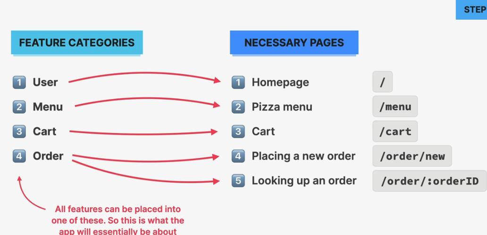
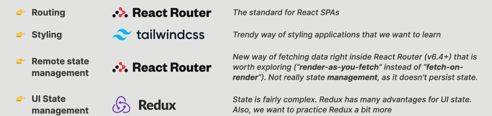

# React Fast Pizza

- **We are building an app for a pizza place where customers can order their pizzas and get them delivered to their homes.**
  - We will only be building the frontend.

###### Planning (for small apps):

1. Break desired UI into components
2. Build static version (w/o state)
3. Think about state managment/data flow

###### Planning (for large apps):

1. Gather application requirments & features
2. Divide application into pages
   - Think about overall and page-level UI
   - Break desired UI into components
   - Design & build a static version (w/o state)
   -
3. Divide the application into feature categorys
   - Think about state managment & data flow
4. Decide which 3rd party libraries to use

##### Applying this process to fast pizza:

**Buisness Requirments**

- Application where users can order one or more pizzas from a menu.
- Requires no user accounts and no login: users just input their names before using the app.
- The pizza menu can change so it should be loaded from an api.✅Done
- Need shoping cart where users can add multiple pizzas before ordering.
- Ordering requires just the user's name, phone number, and address.
- If possible, GPS location should be provided to make delivery easier
- Users can mark their order as "priority" for an additional 20% fee.
- Orders are made by sending a POST request with the oder data (user data +selected pizzas) to the api.
- Payments are made on delivery, so no payment processing is required.
- Each order will get a unique ID that should be displayed, so the user can later look up their order based on the ID.
- Users should be able to mark their order as priority even after the order has been placed.

**Feature Categories**

- User
- Menu
- Cart
- Order

**Pages**

- Home `/`
- Pizza Menu `/menu`
- Cart `/cart`
- Place a new order `/order/new`
- Order Lookp `/order/:orderID`

**State Managment & Tech Decisions**

1. User ---> Global UI state (no accounts, so stays in app)
2. Menu ---> Global Remote State (menu is fetched from api)
3. Cart ---> Global UI state
4. Order ---> Global Remote State (fetched and submitted to API)

**Technology Decisions**

