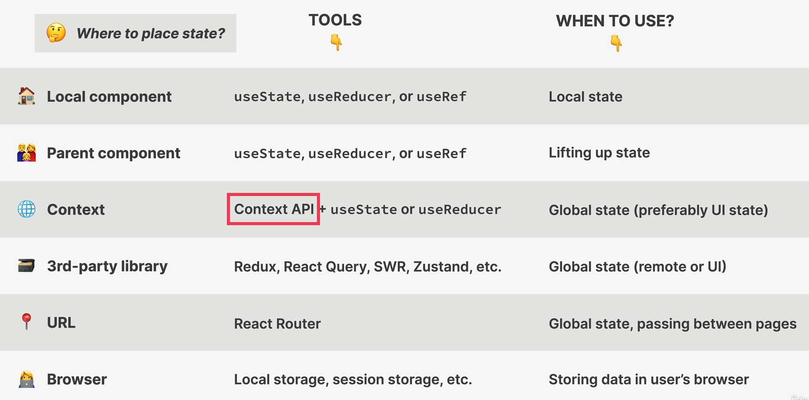
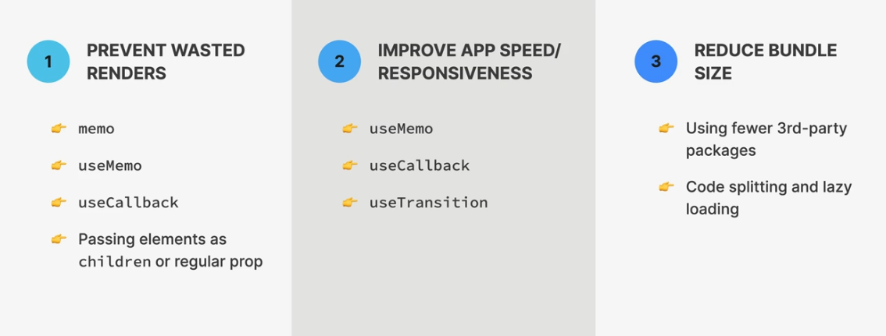

# React

### [Changelog](./Changelog.md)

## React v18 basic setup:

```js
import React from "react";
import ReactDOM from "react-dom/client";
function App() {
  return (
    <div>
      <h1>Hello World!</h1>
    </div>
  );
}
const root = ReactDOM.createRoot(document.getElementById("root"));
root.render(<App />);
```

> With previous versions of react:

```js
import React from "react";
import ReactDOM from "react-dom";
function App() {
  return (
    <div>
      <h1>Hello World!</h1>
    </div>
  );
}
ReactDOM.render(<App />, document.getElementById("root"));
```

- When a component is removed from the view, this is called unmounting.
- When state or props change, the component is re-rendered (this means the component is removed and replaced with the component function using updated state or props).
- state is updated using an event handler or a callback function.
- React is called react because it reacts to state changes by re-rendering the UI.
- In the following code we would expect the incrementStep function to update the state twice...

```js
const incrementStep = () => {
  setStep(step === 3 ? 1 : step + 1);
  setStep(step === 3 ? 1 : step + 1);
};
```

- In reality it only updates once.
- We should not rely on the previous state when updating state.
- If we want to update state based on previous state we should provide a callback function to the setter function.

```js
const incrementStep = () => {
  setStep((prevStep) => (prevStep === 3 ? 1 : prevStep + 1));
  setStep((prevStep) => (prevStep === 3 ? 1 : prevStep + 1));
};
```

> Each instance of a component has and manages it's own state.

## Guidlines for using state:

- Use a state variable for any data the component should keep track of over time. (like a `let` or `var` variable or a `const` array or object that you mutate over time).
- For data that should not trigger a component re-render use a regular variable instead or use a ref.

---

### Controled Elements:

<details>
    <summary>Click to expand</summary>

- by default, input elements like `<input>` and `<select>` maintain their own state in the DOM.
- In React development we like to keep track of state internally in our app... not in the DOM.
- In order to do that we use a technique called controlled elements...
  > Example of a controlled element:

```js
function Form() {
  const [description, setDescription] = useState("");
  function handleSubmit(event) {
    event.preventDefault();
  }
  return (
    <form className="add-form" onSubmit={handleSubmit}>
      <h3>What do you need for your trip?🧳</h3>
      <select>
        {Array.from({ length: 20 }, (_, index) => (
          <option key={index + 1} value={index + 1}>
            {index + 1}
          </option>
        ))}
      </select>
      <input
        type="text"
        name="item"
        placeholder="Item..."
        value={description}
        onChange={(event) => setDescription(event.target.value)}
      />
      <button>Add</button>
    </form>
  );
}
```

- In the above example, the input element is a controlled element because it's value is controlled by the state variable `description`, and the state variable is updated by the `onChange` event handler.

---

</details>

### Difference between props and state:

- State is interal to the component and props are passed in from the parent component.
- State can be changed by the component itself, props cannot be changed by the component itself.
- Props are passed in as attributes to the component.
- When the child compponent recieves new props from the parent component, the child component is re-rendered.

---

## Lifting State Up:

<details>
    <summary>Click to expand</summary>

#### Instructions for lifting up state...

1. Identify the common state: Determine which component(s) need access to the shared state. Look for any data that needs to be shared or updated across these components.
2. Find the closest common ancestor: Identify the closest common ancestor of the components that need access to the shared state. This ancestor component will be responsible for managing and updating the state.
3. Define the state in the ancestor component: Add the necessary state variables to the ancestor component. These state variables will hold the shared data.
4. Pass the state as props: Pass the state variables as props from the ancestor component to the child components that need access to the shared state. This way, the child components can read the state and render accordingly.
5. Update the state: If any component needs to update the shared state, define a function in the ancestor component that modifies the state. Pass this function as a prop to the child components that need to update the shared state.
6. Handle state updates: In the child components, use the passed down function prop to update the state. Call this function whenever the component needs to modify the shared state.

### Before lifting item state up from Form component:

```js
import { useState } from "react";
function App() {
  return (
    <div className="app">
      <Logo />
      <Form />
      <PackingList />
      <Stats />
    </div>
  );
}
function Form() {
  const [description, setDescription] = useState("");
  const [quantity, setQuantity] = useState(1);
  const [items, setItems] = useState([]);
  function handleAddItems(item) {
    setItems((prevItems) => [...prevItems, item]);
  }
  function handleSubmit(event) {
    event.preventDefault();
    //guard clause against empty description
    if (!description) return;
    const newItem = { description, quantity, packed: false, id: Date.now() };
    console.log(newItem);
    handleAddItems(newItem);
    //reset the form
    setDescription("");
    setQuantity(1);
  }
  return (
    <form className="add-form" onSubmit={handleSubmit}>
      <h3>What do you need for your trip?🧳</h3>
      <select
        value={quantity}
        onChange={(event) => setQuantity(Number(event.target.value))}
      >
        {Array.from({ length: 20 }, (_, index) => (
          <option key={index + 1} value={index + 1}>
            {index + 1}
          </option>
        ))}
      </select>
      <input
        type="text"
        name="item"
        placeholder="Item..."
        value={description}
        onChange={(event) => setDescription(event.target.value)}
      />
      <button>Add</button>
    </form>
  );
}
const Item = ({ item }) => {
  return (
    <li key={item.id}>
      <span style={item.packed ? { textDecoration: "line-through" } : {}}>
        {item.description} {item.quantity}
      </span>
      <button>❌</button>
    </li>
  );
};
function PackingList() {
  return (
    <div className="list">
      {" "}
      <ul>
        {initialItems.map((item) => {
          return <Item key={item.id} item={item} />;
        })}
      </ul>
    </div>
  );
}
```

### After lifting item state up from Form component:

```js
import { useState } from "react";
function App() {
  const [items, setItems] = useState([]);
  function handleAddItems(item) {
    setItems((prevItems) => [...prevItems, item]);
  }
  return (
    <div className="app">
      <Logo />
      <Form onAddItem={handleAddItems} />
      <PackingList items={items} />
      <Stats />
    </div>
  );
}
function Form({ onAddItem }) {
  const [description, setDescription] = useState("");
  const [quantity, setQuantity] = useState(1);
  function handleSubmit(event) {
    event.preventDefault();
    //guard clause against empty description
    if (!description) return;
    const newItem = { description, quantity, packed: false, id: Date.now() };
    console.log(newItem);
    onAddItem(newItem);
    //reset the form
    setDescription("");
    setQuantity(1);
  }
  return (
    <form className="add-form" onSubmit={handleSubmit}>
      <h3>What do you need for your trip?🧳</h3>
      <select
        value={quantity}
        onChange={(event) => setQuantity(Number(event.target.value))}
      >
        {Array.from({ length: 20 }, (_, index) => (
          <option key={index + 1} value={index + 1}>
            {index + 1}
          </option>
        ))}
      </select>
      <input
        type="text"
        name="item"
        placeholder="Item..."
        value={description}
        onChange={(event) => setDescription(event.target.value)}
      />
      <button>Add</button>
    </form>
  );
}
const Item = ({ item }) => {
  const description =
    item.quantity > 1 ? `${item.description}s` : item.description;
  return (
    <li key={item.id}>
      <span style={item.packed ? { textDecoration: "line-through" } : {}}>
        {item.quantity} {description}
      </span>
      <button>❌</button>
    </li>
  );
};
function PackingList({ items }) {
  return (
    <div className="list">
      {" "}
      <ul>
        {items.map((item) => {
          return <Item key={item.id} item={item} />;
        })}
      </ul>
    </div>
  );
}
```

---

</details>

### Derived State:

- Derived state is state that is calculated from other state or props.
- If state can be derived from existing state then we do not want to create a new state to represent it because this will result in unnecessary rerendering any time the related state changes.

### Props.children:

- An empty hole that can be filled with any jsx the component recieves as children. The children prop allows us to pass jsx into an element. The only difference is that the children prop is not an html attribute but rather a prop that allows us to access jsx that is passed into the component as children.

```js
function Button(props) {
  const { clickHandler, backgroundColor, textColor } = props;
  return (
    <button style={{ backgroundColor: backgroundColor, color: textColor }} onClick={clickHandler}>
    {props.children}
    </button>
  );
}
export default Button;
// App.js
  <Button clickHandler={decrementStep} backgroundColor="#7950f2" textColor="#fff">
        <span>⏮️</span> Previous
      </Button>
      <Button clickHandler={incrementStep} backgroundColor="#7950f2" textColor="#fff" emoji="⏭️">
        {" "}
        Next<span>⏭️</span>
      </Button>

```

---

## Resources:

👉 [Writing Resilient Components](https://overreacted.io/writing-resilient-components/?ref=jonas.io) (By Dan Abramov from the React team)

👉 [Things I think about when I write React code](https://github.com/mithi/react-philosophies?ref=jonas.io) (GitHub repository)

👉 [A (Mostly) Complete Guide to React Rendering Behavior](https://blog.isquaredsoftware.com/2020/05/blogged-answers-a-mostly-complete-guide-to-react-rendering-behavior/?ref=jonas.io) (By Mark Erikson from the redux team)

👉 [A Visual Guide to React Rendering](https://alexsidorenko.com/blog/react-render-always-rerenders/?ref=jonas.io) (A multi-part series, check out the other ones)

👉 [Inside Fiber: in-depth overview of the new reconciliation algorithm in React](https://indepth.dev/posts/1008/inside-fiber-in-depth-overview-of-the-new-reconciliation-algorithm-in-react?ref=jonas.io)

👉 [A Cartoon Intro to Fiber](https://www.youtube.com/watch?v=ZCuYPiUIONs?ref=jonas.io) (YouTube video)

👉 [What Is React Fiber? React.js Deep Dive](https://www.youtube.com/watch?v=0ympFIwQFJw?ref=jonas.io) (YouTube video)

👉 [The React and React Native Event System Explained](https://levelup.gitconnected.com/how-exactly-does-react-handles-events-71e8b5e359f2?ref=jonas.io)

👉 [Under the hood of event listeners in React](https://gist.github.com/romain-trotard/76313af8170809970daa7ff9d87b0dd5?ref=jonas.io)

👉 [A DIY guide to build your own React](https://github.com/pomber/didact?ref=jonas.io)

👉 [useSyncExternalStore First Look](https://julesblom.com/writing/usesyncexternalstore?ref=jonas.io)

👉 [Under the hood of React's hooks system](https://the-guild.dev/blog/react-hooks-system?ref=jonas.io)

👉 [Why Do React Hooks Rely on Call Order?](https://overreacted.io/why-do-hooks-rely-on-call-order/?ref=jonas.io) (By Dan Abramov
👉 [So you think you know everything about React refs](https://blog.thoughtspile.tech/2021/05/17/everything-about-react-refs/?ref=jonas.io)

👉 [react-use: Reusable React Hook Library](https://github.com/streamich/react-use?ref=jonas.io) (GitHub repository)

👉 [react-hookz: React hooks done right](https://github.com/react-hookz/web?ref=jonas.io) (GitHub repository)

### Reusability:

**General Guidlines**

- Creating new components creates mental abstractions that are hard to keep track of in your mind.
- Name components according to what it does or what it displays... don't be afraid to use long component names.
- NEVER declare a new component inside of another component.
- Colocate related components inside the same file. Don't seperate components into different files too early in development.

---

## How React Works:

<details>
    <summary>Click to expand</summary>

- A component is a function that describes of a part of the UI.
- A component is a function that returns React elements (jsx).
- A component is a generic blueprint or template for which different data will produce different UI.
- Instances are created when we use components in our code.

```js
function Tabbed({ content }) {
  const [activeTab, setActiveTab] = useState(0);
  return (
    <div>
      <div className="tabs">
        <Tab num={0} activeTab={activeTab} onClick={setActiveTab} />
        <Tab num={1} activeTab={activeTab} onClick={setActiveTab} />
        <Tab num={2} activeTab={activeTab} onClick={setActiveTab} />
        <Tab num={3} activeTab={activeTab} onClick={setActiveTab} />
      </div>
      {activeTab <= 2 ? (
        <TabContent item={content.at(activeTab)} />
      ) : (
        <DifferentContent />
      )}
    </div>
  );
}
function Tab({ num, activeTab, onClick }) {
  return (
    <button
      className={activeTab === num ? "tab active" : "tab"}
      onClick={() => onClick(num)}
    >
      Tab {num + 1}
    </button>
  );
}
```

> In the above example, the Tabbed component returns multiple instances of the Tab component.
> _An instance is the actual manifestation of a component that has it's own state and props (and has a lifecycle... i.e. it can be mounted and unmounted)._

- A component instance returns a React element (jsx) The react element is the result of the component function call.
  > Component instance: `console.log(<DifferentContent test={23}/>);` --> type: DifferentContent
  > React element: `console.log(DifferentContent({test: 23}));` --> type: div
- Finally the react element is rendered to the DOM using the ReactDOM.render() function(html)
  **How React Renders Components:**

1. Render is triggered (By updating state somewhere)
2. React calls the component functions and figures out how the Dom should be updated (Render phase). DOM is not actually updated in this phase.
   > In React, rendering is not updating the DOM or displaying elements on the screen. Rendering is the process of figuring out what changes need to be made to the DOM.
3. Commit Phase: React updates the DOM with the changes that were determined in the render phase.
4. Browser paints the screen... (produces visual changes user sees on their screen.)
   **Two situations that trigger renders:**
5. Initial render: When the component is first mounted to the DOM.
6. When state or props change: When state or props change, the component is re-rendered.

- A render is not triggered immediatly but scheduled for when the JS engine has some 'free time' . there is also batching of multiple setState calls in event handlers.
  Two common misconceptions about React:

1. **(false)** _Rendering is updating the screen/DOM_
2. **(false)** _React completely discards old view(DOM) on Re-Renders_
   **Virtual DOM (React Element Tree):**
3. **Initial Render** (Component Tree) gets converted to a React Element Tree (Virtual DOM) by React. This tree of react elements is what we refer to as the virtual dom. In practice this is a tree of all react elements freated from all instances in the component tree. It is cheap and fast to create multiple trees because behind the scenes they are JS-objects not DOM elements.

- In react documentation the term `virtual dom` has been replaced with `react element tree` , but it is still a common term in the community. (**Nothing to do with Shadow Dom.. which is a browser concept that has to do with isolating a branch of the DOM from the rest of the DOM**)
  **Rendering a component will cause all of it's child comonents to be rerendered as well (even if props has not changed)**
  > This is done because React doesn't know if children will be affected by the parent's render. So it just rerenders all children to be safe... remember that rendering is cheap and fast in React.

2. **Rerender Phase**
   Component instaces that triger re-render ---> React Element Tree (virtual dom) ---> Reconcilation + Diffing (Reconciliation is done by React's Reconciler known as Fiber) ---> Updated Fiber Tree (used to write to the DOM).

- What is Reconciliation and why do we need it?
  > Writing to the DOM is relativly slow and usually only a small part of the DOM needs to be updated. Whenever a re-render is triggered, React will try to reuse as much of the existing DOM as possible.
  > **Reconciliation** is the process of deciding which DOM elements actually need to be inserted, deleted, or updated in order to reflect the latest changes in state.
  > The result of reconiliation is a list of DOM operations that need to be performed in order to update the DOM.
- The reconciler (fiber) will create a new fiber tree from the the React Element Tree (Virtual DOM) and has a fiber for each component instance and DOM element... Fibers are not recreated on every rerender. The fiber tree is mutated on each rerender rather than recreated. Fiber keeps track of current state, props, sideEffects and used Hooks (as well as a _queue of work_ to be done) for each component instance.
- A fiber is a unit of work to be done... stored as a linked list for each component instance. The fiber tree is a tree of linked lists. The work can be done asynchronously and paused, resumed, or aborted. In react 18 this enables concurrent features like suspense or transitions. This means long renders won't block the JS engine.
  **Reconciliation:**
- Take the virtual dom and the corresponding fiber tree... let's say a piece of state (that determines of a modal is shown or not) is flipped from true to false... this will cause a new virtual dom where the modal component is removed. All remaning elements were re-rendered. This new React Element Tree(virtual DOM) needs to be reconciled with the existing fiber tree. This will result in an updated fiber tree (work in progress tree).
  
  
- -> In the example in the image above the Btn element (yellow) has different text depending on the state in question and so the work to be done in the fiber tree is to update the DOM with the new text.
- -> The Modal, Overlay, H3, and Button (red) are no longer in the React Element Tree and are thus marked for deletion in the Updated Fiber tree.
- -> Finally we have the Video component which is a child of the App component but it did not change between renders and thus after reconciliation the dom element for the video will not be updated.
- -> Once reconciliation takes place all the dom mutations will be placed into a list called the _list of effects_ which will be used in the next (Commit) phase to update the DOM.
  **Render Phase**
  
  --> results in a list of DOM updates to be done.

---

## Commit Phase

- In the commit phase list of insertions, deletions and updates are "flushed" to the DOM.
- Commit phase is synchronous... DOM is updated in one go, it can't be interrupted. This is necessary so that the DOM never shows partial results, ensuring a consistent UI (in sync with state at all times).
- After the commit phase ompletes the workInProgress fiber tree becomes the current tree for the next render cycle.
- The Render phase is exicuted by the react library and the Browser Paint phase is exicuted by the browser... what about the commit phase? The commit phase is exicuted by the react-dom library.
- The React library is agnostic to the commit phase and the browser paint phase.
- The reason for this is that React can be used with other "hosts" such as react-native or react-three-fiber.
  

---

## Putting it all together:

1. First step is a trigger... (initial render or state update in a component instance)
2. Render phase: In react render means to call the component functions...React creates a new React Element Tree (virtual dom) and recconciles (finds what changes need to be made to current DOM to reflect change in state) it with the current Fiber Tree (work in progress tree) ...Rendering a component will also render all of it's children components (regardless of a change in props). The fiber tree has a fiber for each react component and DOM element.
   

- Complete update

  

---

## How Diffing Works:

- Diffing follows two fundamental rules:

1. Two elements of different types will produce different trees.
2. Elements with a stable key prop stay the same across renders.

### Two cases we need to consider when diffing...

1. Same position, different element.
   
   > React will assume that the element it's self plus all of it's children are no longer valid. Old components are destroyed and removed from the DOM including state.


> The same logic applies to different React elements (component instances) as for differing DOM elements.


2. Same position, same element.
   

> Elements will be kept (as well as child elements) including state.
> New props / attributes are passed if they changed between renders.

- Sometimes this behavior is not what we want... in that case we can use the `key` prop.

```js
function Tabbed({ content }) {
  const [activeTab, setActiveTab] = useState(0);

  return (
    <div>
      <div className="tabs">
        <Tab num={0} activeTab={activeTab} onClick={setActiveTab} />
        <Tab num={1} activeTab={activeTab} onClick={setActiveTab} />
        <Tab num={2} activeTab={activeTab} onClick={setActiveTab} />
        <Tab num={3} activeTab={activeTab} onClick={setActiveTab} />
      </div>

      {activeTab <= 2 ? (
        <TabContent item={content.at(activeTab)} />
      ) : (
        <DifferentContent />
      )}
    </div>
  );
}
```

In the case of the TabContent component we have the same component in the same place... so the state (i.e. how many likes or the show hide state) is preserved as we navigate through the tabs.

- Once we navigate to the Tab 4 we have a different component in the same place... so the state is lost and as such, when we navigate to tabs 1-3 we see that the description is shown and the like count is reset to 0.

### The Key Prop:

- The key prop is a special prop we use to tell the diffing algorithm that the element is unique (works for both DOM elements and React Elements)
- This allows React to distinguish between multiple instances of the same component type.
- When a key stays the same across renders, the element will be kept in the DOM (even if the position in the tree changes).
- We generally use the key prop in lists.
- When a key changes between renders, the element will be destroyed and a new one will be created (even if the position in the tree is the same as before).
- We can use keys to reset state.

```js

<ul>
    <Question question={q[1]}>
    <Question question={q[2]}>
</ul>
```

> adding new list item:

```js
// now they will appear in different positions in the React Element Tree
// They are no longer the first and second children.. but the second and third children.
<ul>
    <Question question={q[0]}>
    <Question question={q[1]}>
    <Question question={q[2]}>
</ul>
```

**Adding Keys**

```js
<ul>
    <Question key="q1" question={q[1]}>
    <Question key="q2" question={q[2]}>
</ul>
```

**Adding new list Item**

```js
<ul>
    <Question key="q0" question={q[0]}>
    <Question key="q1" question={q[1]}>
    <Question key="q2" question={q[2]}>
</ul>
```

**How to reset state using keys**

```js
function Tabbed({ content }) {
  const [activeTab, setActiveTab] = useState(0);

  return (
    <div>
      <div className="tabs">
        <Tab num={0} activeTab={activeTab} onClick={setActiveTab} />
        <Tab num={1} activeTab={activeTab} onClick={setActiveTab} />
        <Tab num={2} activeTab={activeTab} onClick={setActiveTab} />
        <Tab num={3} activeTab={activeTab} onClick={setActiveTab} />
      </div>

      {activeTab <= 2 ? (
        <TabContent item={content.at(activeTab)} key={activeTab} />
      ) : (
        <DifferentContent />
      )}
    </div>
  );
}
```

---

#### Logic in React Components:

**Two types of logic:**

1. Render Logic: Logic that determines what the UI should look like. Code that lives at the top level of a component function.
2. Event Handler Logic: Logic that determines what happens when the user interacts with the UI. (code that does things or reacts to change)


**Functional Programming Principles**

- **Side effect**: dependency on or modification of any data outside of the function scope. "Interaction with the outside world". Some examples are mutating external variables... HTTP requests, writing to the DOM, writing to a database, logging etc.

- **Pure Functions:** _A function that has no side effects(does not change any variables outside it's scope) **Given the same input a pure function will always return the same output**_

```js
//pure function:
function add(a, b) {
  return a + b;
}
//impure function:
function add(a, b) {
  return a + b + Math.random();
}
```

### Rules for Render Logic:

- **Components must be pure when it comes to render logic:** given the same props(input), a component instance sould always return the same JSX(output).
- **Render logic must produce no side effects:** no interaction with the "outside world" is allowed.
  - Do not perform network requests (API calls)
  - Do not start timers
  - Do not directly use the DOM API
  - Do not mutate variables outside the scope of the function (this is why we can't mutate props)
  - Do not update state (or Refs): this will create an infinite loop of renders.

---

### State Update Batching:

- Renders are not triggered immediatly , but scheduled for when the JS engine has some "free time". There is also batching of multiple setState calls in event handlers.
- Updating state is asynchronous.
  
  > example:

```js
function App() {
  const [answer, setAnswer] = useState("");
  const [best, setBest] = useState(true);
  const [solved, setSolved] = useState(false);
  function reset() {
    setAnswer("");
    console.log(answer);
    setBest(true);
    setSolved(false);
  }
  return (
    <div>
      <button onClick={reset}>Reset</button>
    </div>
  );
}
```

- In the above example you might think that a render cycle takes place for each call to setState... but in reality the state updates are batched together and the render cycle is only triggered once.
- All three pieces of state in the event handler are updated at once.
  

- If we need to update state based on a previous update, we use setState with a callback function.
  `setAnswer((prevAnswer) => prevAnswer + 'a');`

**Makin the tripple like button work:**

```js
function handleInc() {
  setLikes(likes + 1);
}
function trippleInc() {
  setLikes((prevLikes) => prevLikes + 1);
  setLikes((prevLikes) => prevLikes + 1);
  setLikes((prevLikes) => prevLikes + 1);
}
```

---

## Events in React:

- Event propagation and delegation: when a click event takes place on a button in the DOM tree... an event object is created at the root of the document.
- The event will travel down the DOM tree (until it reaches the target) during what is called the capturing phase.
- After the target is reached the event will travel back up the DOM tree during what is called the bubbling phase.
- By default all event handlers listen to events on the target and during the bubbling phase... so an event on a child element will trigger the event handler on a parent of the child during the bubbling phase.
- We can prevent this default behavior by calling the `stopPropagation()` method on the event object.
- The reason for this behavior is an important technique called **Event Delegation** which is the process of handling events for multiple elements in one single parent element.


### How React Handles Events:


**Synthetic Events:**

- When we create an event listener... react gives us access to an event object. In react, this event object is called a synthetic event... native events such as :(pointer event, mouse event, keyboard event) have wrappers around them to create synthetic events which expose the same interface... i.e. `stopPropagation()` and `preventDefault()` methods.
- The main difference between native events and synthetic events is that synthetic events are made such that they have the same behavior regardless of the browser.
- Most synthetic events bubble (including focus, blur and change), except for scroll (which does not bubble in react).
- In react event handlers are written with camel case... i.e. `onClick` instead of `onclick`.
- In vanilla JS default behavior can be prevented by returning false from the event handler... in react we use the `preventDefault()` method on the event object.
- In the rare case that you need to handle an event during the capture phase rather than the bubbling phase... you can use the `onClickCapture` prop instead of the `onClick` prop.

---

### Libraries vs. Frameworks & The React Ecosystem:

- A framework is an all in one kit... it has everything you need but it locks you into certain ways of doing things.
- A library is a collection of tools that you can use to build your own solution.
- React is a library, Angular is a Framework.
- Next.js, Gatsby and Remix are frameworks built on top of React.


---

## Summary of React Fundamentals:

- A component is like a blueprint for a piece of UI that will eventually exist on the screen, when we use a component, React creates a component instance, which is the physical manifestation of the component, contaning props, state...etc. A component instance, when rendered will return a React element.
- Rendering only means calling component functions and calculating what DOM elements need to be inserted, deleted or updated. It has nothing to do with actually writing to the DOM. Therefore, each time a component instance is rendered and rerendered, the function is called again.
- Only the initial app render and state updates can cause a render, which happens for the entire application, not just one single component.
- When a component instance get's rerendered, all it's children will get rerendered as well. This does not mean that all children will get updated in the DOM, thanks to reconciliation, which checks which elements have actually changed between two renders.
- Diffing is how React decides which DOM elements need to be added or modified. If between renders, a certain React element stays at the same position in the element tree, the corresponding DOM elment and component state will stay the same. If the element changed to a different position, or if its a different element type, the DOM element and state will be destroyed.
- Giving elements a key prop allows React to distinguish between multiple component instances. When a key stays the same across renders, the element is kept int the DOM. This is why we use keys in lists. When we change the key between renders, the DOM element will be destroyed and rebuilt... this behavior can be leveraged to reset state.
- The logic that produces JSX output for a component instance ('render logic') is not allowed to produce any side effects: no API calls, no timersm no object or variable mutations, no state updates. Side effects are allowed in event handlers and useEffect hooks.
- The DOM is updated in the commit phase, but not by React, but by a 'renderer' called ReactDOM.
- Multiple state updates inside an event handler function are batched, so they all happen at once, causing only one rerender. This means we can not access a state variable immediatly after updating it: state updates are asynchronus. Since react 18, batching also happens in timeouts, promises and native event handlers.
- When uing events in event handlers, we get access to a synthetic event object, not the browser's native object, so events work the same way across all browsers. This difference is that most synthetic events bubble, including focus, blur and change, which do not bubble as native browser events. Only the scroll event does not bubble.

---

---

</details>

## Effects & Data Fetching:

<details>
    <summary>Click to expand</summary>

**Component (instance) Lifecycle:**

- **Mount/ Initial Render** : component instance is rendered for the first time. Fresh state and props are created.
- **Update / Rerender** : component instance is rerendered because state or props changed, or because a parent component rerendered or Context changed.
- **Unmount** : component instance is removed from the DOM, state and props are destroyed as well.

**Why we need the useEffect Hook:**

- Effects run asynchronously after the component is painted to the browser.

```js
const [movies, setMovies] = useState([]);
const [watched, setWatched] = useState([]);
fetch(`http://www.omdbapi.com/?i=tt3896198&apikey=${KEY}&s=batman`)
  .then((res) => res.json())
  .then((data) => setMovies(data.Search));
```

- This code results in an infinite loop of network requests

**useEffect** takes two arguments... a callback function and a dependency array.

- The callback function is called after the component is rendered for the first time and after every rerender.
- The dependency array is an array of values that the useEffect hook will watch for changes. If any of the values in the dependency array change between renders, the callback function will be called again.

```js
useEffect(() => {
  fetch(`http://www.omdbapi.com/?i=tt3896198&apikey=${KEY}&s=batman`)
    .then((res) => res.json())
    .then((data) => setMovies(data.Search));
}, []);
```

- In the case where the dependency array is empty, the callback function will only be called after the initial render (onMount).

- In the context of React... a side effect is any interaction between a component and the world outside the component. We can think of a side effect as 'code that actualy does something'. Examples include data fetching, setting up subscriptions, setting up timers, manually accessing the DOM etc...

**Where to create a side effect**

- Sometimes we want to initiate a side effect as a result of an event but other times we want to initiate a side effect when the component renders.

- The useEffect hook allows us to write code that will run at different points in the lifecycle of the component (mount, update, unmount).


- We use effects to keep a component synchronized with some external system... i.e. an API of movie data.

- Whenever possible...create side effects inside of an event handler rather than a useEffect hook.
- The function that is the first argument to useEffect must be synchronus so you have to put another function inside of it if you want to do something asyncronus.

```js
useEffect(() => {
  async function fetchMovies() {
    const response = await fetch(
      `https://www.omdbapi.com/?apikey=${KEY}&s=${query}`
    );
    const data = await response.json();
    setMovies(data.Search);
  }
  fetchMovies();
}, [query]);
```

**With error and loading states... plus a finally block to run at the end incase of error or sucess to prevent loading state being true in case of error**

```js
useEffect(() => {
  async function fetchMovies() {
    try {
      setLoading(true);
      setError("");
      const response = await fetch(
        `https://www.omdbapi.com/?apikey=${KEY}&s=${query}`
      );
      if (!response.ok)
        throw new Error("Something went wrong while fetching the movies");

      const data = await response.json();
      if (data.Response === "False") throw new Error("No movies found");
      setMovies(data.Search);
    } catch (err) {
      setError(err.message);
    } finally {
      setLoading(false);
    }
  }
  if (query.length < 2) {
    setMovies([]);
    setError("");
    return;
    //if the query is empty or not long enough then we won't even try to fetch the movies
  }
  fetchMovies();
}, [query]);
```

**useEffect Dependency Array:**

- By default, effects run after every render. We can prevent that by passing a dependency array. Without the dependency array react doesn't know when to run the effect. Each time one of the dependencies changes, the effect will run again. If the dependency array is empty, the effect will only run after the initial render.

**Every state variable and prop used inside the effect MUST be included in the dependency array.**

> You can think of useEffect as an event listener that is listening for one dependency to change. When that dependency changes, the effect will run again.

|                        | Synchronization                          | Lifecycle                                                |
| ---------------------- | ---------------------------------------- | -------------------------------------------------------- |
| useEffect(fn, [x,y,z]) | Effect synchronizez with x,y and z       | Runs on mount and re-renders triggered by updating x,y,z |
| useEffect(fn, [])      | Effect synchronizes with not state/props | Runs only on mount(initial render)                       |
| useEffect(fn)          | Effect synchronizes with everything      | runs on every render (usually bad)                       |

**Order of effects based on dependency array**

```js
export default function App() {
  useEffect(() => {
    console.log("After initial render");
  }, []);
  useEffect(() => {
    console.log("After every render");
  });

  //----------------------
  console.log("During Render");
}
```

**Cleanup Function:**

- In useEffect a cleanup function is a function that is returned from the callback function. This function will be called before the next effect is run and before the component is unmounted.
- The cleanup function is also exicuted on rerenders before the effect is run again.
- The cleanup function is optional and if used is returned from the callback function in the useEffect hook.
- It runs on two occasions:
  1. Before the next effect is run.
  2. Before the component is unmounted.

**Use Case for Cleanup Function:**

- Whenever the side effect keeps happening after the component has been re-rendered or unmounted.
- For example you may have a http request in your effect and during the process of the request the component gets rerendered causing a new http request to be fired off (this specific issue is called a race condition).


**Each effect should only do one thing**

- This makes effects easier to understand and it makes cleanup easier to write.

> Example:

```js
useEffect(() => {
  document.title = title || "Movie Details";
  //cleanup function
  return function () {
    document.title = "Movie List";
    console.log(`Cleanup for movie ${title}`); //star wars
  };
}, [title]);
```

- This cleanup function runs after the component has unmounted but the title is still star wars because the cleanup function is a closure which means it remembers all the variables that existed when it was created.

**How to abort excess http requests using cleanup function**

```js
useEffect(() => {
  const controller = new AbortController();

  async function fetchMovies() {
    try {
      setLoading(true);
      setError("");

      const response = await fetch(
        `https://www.omdbapi.com/?apikey=${KEY}&s=${query}`,
        { signal: controller.signal }
      );

      if (!response.ok)
        throw new Error("Something went wrong while fetching the movies");

      const data = await response.json();
      if (data.Response === "False") throw new Error("No movies found");

      setMovies(data.Search);
      setError("");
    } catch (err) {
      //if check prevents the error from being set if the request was aborted (JS considers this an error but in this case we meant to do it)
      if (err.name === "AbortError") {
        setError(err.message);
      }
    } finally {
      setLoading(false);
    }
  }
  if (query.length < 3) {
    setMovies([]);
    setError("");
    return;
  }

  fetchMovies();
  return function () {
    controller.abort();
  };
}, [query]);
```

**How to close MovieDetail when escape key is pressed**

```js
useEffect(() => {
  document.addEventListener("keydown", (event) => {
    if (event.code === "Escape") {
      handleCloseMovie();
      console.log("Escape key pressed");
    }
  });
}, []);
```

**How to use a cleanup function to remove an event listener**

```js
//-----Escape Key Effect-----//
useEffect(() => {
  function handleKeyPress(event) {
    if (event.code === "Escape") {
      onCloseMovie();
      console.log("Escape key pressed");
    }
  }

  document.addEventListener("keydown", handleKeyPress);
  return function () {
    document.removeEventListener("keydown", handleKeyPress);
  };
}, [onCloseMovie]);
```

</details>

---

---

## React Hooks

<details>
    <summary>Click to expand</summary>

- React hooks are special built in functions that allow us to hook into the internal functionality of React.
  -i.e. Creating and accesing state from the Fiber Tree

  - registering side effects in the Fiber tree.
  - Manual manipulation of the DOM.

- Hooks always start with the word `use` i.e. `useState` or `useEffect` or `useRef` etc...
- Enable easy reuse of non-visual logic: we can compose multiple hooks into our own custom hooks.
- Hooks gave functional components the ability to have their own state and run side effects at different points in the lifecycle of the component (previously, this was only possible with class components).

**Rules of Hooks**

1. Hooks can only be used at the top level of the component.

- This means do not call hooks inside conditionals, loops or nested functions or after early return. (this ensures that hooks are always called in the same order which is important for the fiber tree which is a linked list of hooks... that only have a link to the next hook in the list)

2. Only call hooks from React Functions.

- This means you can only call a hook from a function component or a custom hook.

**You don't need to wory about these rules if you use a linter like eslint-plugin-react-hooks**

**Persisting watched movies in local storage (Method 1):**

```js
function handleAddWatched(movie) {
  setWatched((watched) => [...watched, movie]);
  localStorage.setItem("watched", JSON.stringify([...watched, movie]));
}
```

**useState Hook:**

- We can use a callback to update state... but we can also use a callback to initialize state(lazy initial state).

```js
const [watched, setWatched] = useState(() => {
  const saved = JSON.parse(localStorage.getItem("watched"));
  return saved ? saved : [];
});

//----------Save watched movie to local storage----------//

useEffect(() => {
  localStorage.setItem("watched", JSON.stringify(watched));
}, [watched]);
```

```js
//We do not need to do this because the useEffect runs every time the component is rendered and the state is updated... which does the same thing anyway.
function handleDeleteWatched(id) {
  setWatched((watched) => watched.filter((movie) => movie.imdbID !== id));
  localStorage.setItem(
    "watched",
    JSON.stringify(watched.filter((movie) => movie.imdbID !== id))
  );
}
```

### useState Summary:

- We use the useState hook to create and update state.

```js
const [state, setState] = useState(initialState);
```

- We can also use a callback function to initialize state (lazy initial state).
- In this case, the function must be pure(no side effects) and accept no arguments, it is only called on the initial render.

```js
const [watched, setWatched] = useState(() => {
  const saved = JSON.parse(localStorage.getItem("watched"));
  return saved ? saved : [];
});
```

- **Updating State**
- We can update state by calling the setState function returned from useState and passing in a value or a callback function.

```js
setWatched({imdbID: "tt2527336", title: "Star Wars: Episode VIII - The Last Jedi", year: "2017", userRating: 8,…})
// or
setWatched((watched) => [...watched, movie]);
```

- Remember that when updating state you must NOT mutate objects or arrays... instead you must replace them.

</details>

---

## Refs:

<details>
    <summary>Click to expand</summary>

**How not to select DOM elements in React**

- This works but it is not the React way of doing things and the direct DOM manipulation will at best slow down the performance.
- Also, if you were to add a dependency to the useEffect you would focus the element over and over again...

```js
useEffect(() => {
  const el = document.querySelector(".search");
  console.log(el);
  el.focus();
}, []);
```

### useRef Hook:

- A Ref is like a "box" with a mutable `.current` property that is persisted across renders ("normal" variables are always reset on rerenders).


- This gives us two main use cases:

1. Creating variables that stay the same between renders (i.e. previous state, setTmeout id, etc...)
2. Selecting and storing DOM elements.

   - We ususally mutate the current property of a Ref inside of a useEffect.

_Refs are for data that is NOT rendered: usually ony appear in event handlers or effects, not in JSX (otherwise we use state)_


**How to fucus the search bar using a REF**

```js
const searchInputRef = useRef(null);

useEffect(() => {
  searchInputRef.current.focus();
}, []);
```

> In the example above the `searchInputRef.current` is the DOM element that the ref is pointing to.

</details>

---

## Custom Hooks:

<details>
    <summary>Click to expand</summary>

- Allow us to reuse non-visual logic in multiple components.
- One custom hook should have only one purpose (in order to make it reusable).
- The normal rules of hooks apply to custom hooks too.
- Custom hooks always need to use one or more react hooks.
- Custom hooks are functions that need to start with the word `use` i.e. `useFetch` or `useLocalStorage` etc...

  

> Example:

```js
function useFetch(url) {
  const [data, setData] = useState([]);
  const [loading, setLoading] = useState(false);

  useEffect(() => {
    fetch(url)
      .then((res) => res.json())
      .then((data) => setData(data));
  }, []);
  return [data, loading];
}
```

**Two main use cases for custom hooks:**

1. ) Reuse stateful logic between components

```js
import { useState, useEffect } from "react";

export function useLocalStorageState(initialState, key) {
  const [value, setValue] = useState(() => {
    const saved = JSON.parse(localStorage.getItem(key));
    return saved ? saved : initialState;
  });

  //----------Save watched movie to local storage----------//

  useEffect(() => {
    localStorage.setItem(key, JSON.stringify(value));
  }, [value, key]);

  return [value, setValue];
}
```

> Another example:

```js
//-----------useKeypress Hook-----------//
export function useKeypress(key, action) {
  useEffect(() => {
    function handleKeyPress(event) {
      if (event.code.toLowerCase() === key.toLowerCase()) {
        action();
        console.log(`${key} key pressed`);
      }
    }

    document.addEventListener("keydown", handleKeyPress);
    return function () {
      document.removeEventListener("keydown", handleKeyPress);
    };
  }, [action, key]);
}
//----------------------------------//
//-------------in Search.js-------------//
useKeypress("Enter", () => {
  if (document.activeElement === searchInputRef.current) return;
  searchInputRef.current.focus();
  //clear text in search bar.
  setQuery("");
});
//---------------in MovieDetail.js-------------------//
useKeypress("Escape", onCloseMovie);
// where on onCloseMovie is a prop passed in from App.js
```

2. ) Abstract away complex logic into a custom hook

```js
import { useEffect, useState } from "react";

export function useMovies(query, callback, key) {
  const [movies, setMovies] = useState([]);
  const [loading, setLoading] = useState(false);
  const [error, setError] = useState("");

  useEffect(() => {
    callback?.();
    const controller = new AbortController();

    async function fetchMovies() {
      try {
        setLoading(true);
        setError("");

        const response = await fetch(
          `https://www.omdbapi.com/?apikey=${key}&s=${query}`,
          { signal: controller.signal }
        );

        if (!response.ok)
          throw new Error("Something went wrong while fetching the movies");

        const data = await response.json();
        if (data.Response === "False") throw new Error("No movies found");

        setMovies(data.Search);
        setError("");
      } catch (err) {
        if (err.name === "AbortError") {
          setError(err.message);
        }
      } finally {
        setLoading(false);
      }
    }
    if (query.length < 3) {
      setMovies([]);
      setError("");
      return;
    }

    fetchMovies();
    return function () {
      controller.abort();
    };
    // eslint-disable-next-line react-hooks/exhaustive-deps
  }, [query, key]);
  return { movies, loading, error };
}
```

</details>

---

---

## useReducer hook:

<details>
    <summary>Click to expand</summary>

#### the useReducer hook is another state managment hook that is used to manage more complex state, when the current state depends on the previous state.

- Works by storing related pieces of state in a state object (could be a primative but usually we use an object).
- `useReducer` needs a reducer function containing the logic for updating state and and decouples state logic from component.
- The **Reducer** is a _pure function(**no side effects**)_ , that takes current state and action and returns the next state.
  - Keep in mind that react state is immutable so we can't mutate the state object directly... instead we need to return a new state object (**No side effects allowed in the reducer**).
- The action is an object that describes how to update state (**the action object usually contains a action type and sometimes an action payload**).
- `useReducer` returns a dispatch function that we can use to trigger state updates by sending `actions` from event handlers to the reducer.

```js
const [state, dispatch] = useReducer(reducer, initialState);
// example of a reducer function
function reducer(state, action) {
  switch (action.type) {
    case "ACTION_TYPE_1":
      // logic for ACTION_TYPE_1
      return newState1;
    case "ACTION_TYPE_2":
      // logic for ACTION_TYPE_2
      return newState2;
    default:
      return state;
  }
}

// example of a dispatch function
dispatch({ type: "ACTION_TYPE_1", payload: data });

//------------------------------------------------------------//
//putting it all together:

import React, { useReducer } from "react";

// Reducer function
function counterReducer(state, action) {
  switch (action.type) {
    case "INCREMENT":
      return { count: state.count + 1 };
    case "DECREMENT":
      return { count: state.count - 1 };
    default:
      return state;
  }
}

function Counter() {
  const [state, dispatch] = useReducer(counterReducer, { count: 0 });

  return (
    <div>
      Count: {state.count}
      <button onClick={() => dispatch({ type: "INCREMENT" })}>+</button>
      <button onClick={() => dispatch({ type: "DECREMENT" })}>-</button>
    </div>
  );
}
```

- A reducer function is a pure function that will always take in the previous state and an action as arguments and return the new state.
- In ` const [count, dispatch] = useReducer(reducer, 0);` the `useReducer` hook returns state... i.e. `count` and a dispatch function... i.e. `dispatch`, that can also be used to update state.
  > Example: If we have the following code:

```js
function reducer(state, action) {
  console.log("State:", state, "action:", action);
  return state + action;
}

function DateCounter() {
  //   const [count, setCount] = useState(0);

  const [count, dispatch] = useReducer(reducer, 0);

  const inc = function () {
    dispatch(1);
    // setCount((count) => count + 1);
    // setCount((count) => count + step);
  };
  //...
}
```

- When we press the increment button we get an output of 0,1 in the console... this is because the reducer function is called with the current state and the action that we dispatch... in this case the action is 1 `dispatch(1);`.

- dispatch is a state updating function that takes in an action as an argument and returns the new state, you can think of it as being similar to setState.


> MVP for date counter using useReducer:

```js
import { useReducer } from "react";

function reducer(state, action) {
  console.log("State:", state, "action:", action);
  switch (action.type) {
    case "increment":
      return { ...state, count: state.count + state.step };
    case "decrement":
      return { ...state, count: state.count - state.step };
    case "setCount":
      return { ...state, count: action.payload };
    case "setStep":
      return { ...state, step: action.payload };
    case "reset":
      return { ...state, count: 0, step: 1 };
    default:
      throw new Error("Unexpected action");
  }
}

function DateCounter() {
  const initialState = {
    count: 0,
    step: 1,
  };
  const [state, dispatch] = useReducer(reducer, initialState);
  const { count, step } = state;

  // This mutates the date object.
  const date = new Date("june 21 2023");
  date.setDate(date.getDate() + count);

  const dec = function () {
    dispatch({ type: "decrement" });
  };

  const inc = function () {
    dispatch({ type: "increment" });
  };

  const defineCount = function (e) {
    dispatch({ type: "setCount", payload: Number(e.target.value) });
  };

  const defineStep = function (e) {
    dispatch({ type: "setStep", payload: Number(e.target.value) });
  };

  const reset = function () {
    dispatch({ type: "reset" });
  };

  return (
    <div className="counter">
      <label htmlFor="step">Step Size</label>
      <div>
        <input
          type="range"
          min="0"
          max="10"
          value={step}
          onChange={defineStep}
        />
        <span>{step}</span>
      </div>

      <div>
        <button onClick={dec}>-</button>
        <input value={count} onChange={defineCount} />
        <button onClick={inc}>+</button>
      </div>

      <p>{date.toDateString()}</p>

      <div>
        <button onClick={reset}>Reset</button>
      </div>
    </div>
  );
}
export default DateCounter;
```


**Use cases for useReducer**

- `useReducer` is a great way for setting up complex state or related pieces of state.

  - When components have lots of state variables & state updates, spread across many event handlers all over the component.
  - When multiple state updates need to happen at the same time as a reaction to the same event (i.e. a form submission, or starting a game).
  - When updating one piece of state depends on one or multiple other pieces of state.

**How reducers update state**


##### React Quiz Reducer Logic:

```js
import { useEffect, useReducer } from "react";

const initialState = {
  questions: [],
  // loading, error, ready, active,finished
  status: "loading",
  index: 0,
  answer: null,
  points: 0,
  highscore: 0,
};

function reducer(state, action) {
  switch (action.type) {
    case "dataRecieved":
      return { ...state, questions: action.payload, status: "ready" };
    case "dataFailed":
      return { ...state, status: "error" };
    case "start":
      return { ...state, status: "active" };
    case "newAnswer":
      const curQuestion = state.questions.at(state.index);
      // recieved answer from user is action.payload
      return {
        ...state,
        answer: action.payload,
        points:
          action.payload === curQuestion.correctOption
            ? state.points + curQuestion.points
            : state.points,
      };
    case "nextQuestion":
      return { ...state, index: state.index + 1, answer: null };
    case "finish":
      return {
        ...state,
        status: "finished",
        highscore:
          state.points > state.highscore ? state.points : state.highscore,
      };
    case "restart":
      return {
        ...initialState,
        status: "ready",
        highscore: state.highscore,
        index: 0,
        questions: state.questions,
      };
    default:
      throw new Error(`Unknown action type: ${action.type}`);
  }
}

function App() {
  const [{ questions, status, index, answer, points, highscore }, dispatch] =
    useReducer(reducer, initialState);

  //derived state
  const numQuestions = questions.length;
  const maxPoints = questions.reduce((acc, cur) => acc + cur.points, 0);

  useEffect(() => {
    const fetchData = async () => {
      try {
        const res = await fetch("http://localhost:8000/questions");
        const data = await res.json();
        dispatch({ type: "dataRecieved", payload: data });
      } catch (err) {
        dispatch({ type: "dataFailed" });
      }
    };
    fetchData();
  }, []);

  return (
    <div className="app">
      <Header />
      <Main>
        {status === "loading" && <Loader />}
        {status === "error" && <Error />}
        {status === "ready" && (
          <StartScreen numQuestions={numQuestions} dispatch={dispatch} />
        )}
        {status === "active" && (
          <>
            <Progress
              index={index}
              numQuestions={numQuestions}
              points={points}
              maxPoints={maxPoints}
              answer={answer}
            />
            <Question
              question={questions[index]}
              dispatch={dispatch}
              answer={answer}
            />
            <NextButton
              dispatch={dispatch}
              answer={answer}
              index={index}
              numQuestions={numQuestions}
            />
          </>
        )}
        {status === "finished" && (
          <FinishedScreen
            points={points}
            maxPoints={maxPoints}
            index={index}
            numQuestions={numQuestions}
            highscore={highscore}
            dispatch={dispatch}
          />
        )}
      </Main>
    </div>
  );
}

export default App;
```

---

#### useState vs. useReducer:


</details>

---

---

## React Router:

<details>
    <summary>Click to expand</summary>

- React Router is a powerful routing library built on top of React, which helps in adding new screens and flows to your application. This library keeps your UI in sync with the URL.

## Installation

To get started with React Router, you need to install it:

```bash
npm install react-router-dom
```

## Basic Components

React Router provides a set of core components to implement routing:

1. `BrowserRouter`: Uses the HTML5 history API to keep your UI in sync with the URL.
2. `Route`: Renders some UI when its path matches the current URL.
3. `Link`: Provides declarative, accessible navigation around your application.

## Basic Usage

Here's a simple example of setting up routing for a React application:

```jsx
import React from "react";
import { BrowserRouter as Router, Route, Link } from "react-router-dom";

function App() {
  return (
    <Router>
      <div>
        <nav>
          <ul>
            <li>
              <Link to="/">Home</Link>
            </li>
            <li>
              <Link to="/about">About</Link>
            </li>
          </ul>
        </nav>

        <Route path="/" exact component={Home} />
        <Route path="/about" component={About} />
      </div>
    </Router>
  );
}

function Home() {
  return <h2>Home</h2>;
}

function About() {
  return <h2>About</h2>;
}

export default App;
```

In the above example, when the user clicks on the "Home" or "About" links, the corresponding component (`Home` or `About`) gets rendered below the navigation.

## Nested Routes

React Router also supports nested routes, allowing for more complex layouts and routing logic.

## Conclusion

React Router is an essential tool for building single-page applications (SPAs) with React. It provides a way to manage and handle different views of your application efficiently.

For more advanced features and configurations, refer to the [official React Router documentation](https://reactrouter.com/).

<details>
<summary>using VITE</summary>
- When using vite don't forget to configure eslint.

```bash
npm i eslint vite-plugin-eslint eslint-config-react-app --save-dev
```

> create file `.eslintrc.json`

```json
{
  "extends": ["react-app"]
}
```

```bash
npm create vite@latest
```

</details>

##### With routing we match different URLs to different UI views(react components):routes


**This allows the ueer to navigate between different application screens using the browser url**

#### Single Page Applications (SPAs):

- Application that is executed entirley on the client (browser).
- **Routes**: different URLs correspond to different views(components)
- **Javascript** is used to update the page (DOM)
- The page is never reloaded
- Additional data might be loaded from a web API.

#### Basic Setup for React Router:

```js
import { BrowserRouter, Routes, Route } from "react-router-dom";
import Product from "./pages/Product";
import Home from "./pages/Home";
import Pricing from "./pages/Pricing";
function App() {
  return (
    <div>
      <h1>This H1 would appear on all routes...</h1>
      <BrowserRouter>
        <Routes>
          <Route path="/" element={<Home />} />
          <Route path="product" element={<Product />} />
          <Route path="pricing" element={<Pricing />} />
        </Routes>
      </BrowserRouter>
    </div>
  );
}

export default App;
```

**How to match any route that was not matched by any other route:**

```js
function App() {
  return (
    <BrowserRouter>
      <Routes>
        <Route path="/" element={<Home />} />
        <Route path="product" element={<Product />} />
        <Route path="pricing" element={<Pricing />} />
        <Route path="*" element={<NotFound />} /> <----------this is how
      </Routes>
    </BrowserRouter>
  );
}
```


**Why we don't use anchor tags for navigation with React Router**

```js
function Home() {
  return (
    <div>
      <h1>Home Worldwise</h1>
      <a href="/pricing">Pricing</a>
    </div>
  );
}

export default Home;
```

- Tha above code does technically work and will navigate to the pricing page... but it does cause the page to reload.

**Showing currently active link**

- We can replace this:

```js
import { Link } from "react-router-dom";
function Nav() {
  return (
    <nav>
      <ul>
        <li>
          <Link to="/">Home</Link>
        </li>
        <li>
          <Link to="/product">Product</Link>
        </li>
        <li>
          <Link to="/pricing">Pricing</Link>
        </li>
      </ul>
    </nav>
  );
}

export default Nav;
```

- with this:

```js
import { NavLink } from "react-router-dom";
function Nav() {
  return (
    <nav>
      <ul>
        <li>
          <NavLink to="/">Home</NavLink>
        </li>
        <li>
          <NavLink to="/product">Product</NavLink>
        </li>
        <li>
          <NavLink to="/pricing">Pricing</NavLink>
        </li>
      </ul>
    </nav>
  );
}

export default Nav;
```

- The NavLink component adds a class `"active"` to the currently active link.

### Styling Options for React:


**Using CSS modules**

- CSS modules are a way to scope CSS to a specific component.
- CSS modules are enabled by default in create-react-app & vite.
- In order to create a CSS module you need to name the file with the `.module.css` extension.

How to apply styles to a component using CSS modules:

```js
import { NavLink } from "react-router-dom";
import styles from "./Nav.module.css";
function Nav() {
  return <nav className={styles.nav}>//...</nav>;
}

export default Nav;
```

> Nav.module.css

```css
.nav {
  display: flex;
  justify-content: space-between;
}
```

**When using css modules you _do not want to use element selectors_ like `ul{...}` because they will apply to all ul elements in the app... instead you want to use class selectors like `.nav{...}`**

> If we don't want to scope a style specifically to the component for which we created the module wew can use the `:global` selector.

```css
:global(.nav) {
  display: flex;
  justify-content: space-between;
}
```

- The above example would apply to any className of `nav` in the app.

---

#### Nested Routes:

> `http://127.0.0.1:5173/app/cities/` <--- this is a nested route

- This is how we would set up nested routes in React Router:

```js
<Route path="app" element={<AppLayout />}>
  <Route
    path="cities"
    element={<p>This could be a react component or just JSX</p>}
  />
</Route>
```

**The `<Outlet />` component**

- The Outlet component serves as a placeholder where the child routes will render. When you have nested routes, the parent route's component will typically render an Outlet to indicate where its child routes should appear.

> example:

```js
// App.js
import {
  BrowserRouter as Router,
  Routes,
  Route,
  Outlet,
} from "react-router-dom";

function App() {
  return (
    <Router>
      <Routes>
        <Route path="/" element={<MainLayout />}>
          <Route index element={<Home />} />
          <Route path="dashboard" element={<Dashboard />} />
        </Route>
      </Routes>
    </Router>
  );
}

function MainLayout() {
  return (
    <div>
      <h1>Welcome to Our App</h1>
      <Outlet /> {/* This is where child routes will render */}
    </div>
  );
}

function Home() {
  return <h2>Home Page</h2>;
}

function Dashboard() {
  return <h2>Dashboard Page</h2>;
}
```

- In the above example, when the user navigates to the root path /, they'll see "Welcome to Our App" followed by "Home Page". If they navigate to /dashboard, they'll see "Welcome to Our App" followed by "Dashboard Page". This is because the Outlet in MainLayout serves as the placeholder for the child routes.

###### Key Takeaways:

1. The Outlet component is essential for nested routing in React Router.
2. It acts as a placeholder, indicating where child routes should render within their parent route's component.
3. If no nested route matches, the Outlet will render nothing.


**An index route is the default child route if the last part of the nested route doesn't match any of the child routes.**

- In React Router, the index prop on a `<Route />`` component is used to specify a default child route that _should render when its parent route is matched exactly_.

- When you have nested routes, sometimes you want to render a specific child route by default when the parent's path is accessed. The index prop helps in achieving this behavior.

```js
<Route path="app" element={<AppLayout />}>
  <Route index element={<p>Index Route</p>} />
  <Route
    path="cities"
    element={<p>This could be a react component or just JSX</p>}
  />
  <Route path="countries" element={<p>sibling route to cities</p>} />
  <Route path="form" element={<p>another sibling route</p>} />
</Route>
```

---

#### Storing State in the URL:

- The URL is an excellent place to store UI state and an alternative to useState in some situations. Examples: open/closed panels, currently selected list item, list sorting order, applied list filters.
  - The advantage of this is that it's an easy way to store state in a global place accessable to all components in the app.
  - It's also a good way to pass data from one page to the next page.
  - This also makes it possible to bookmark and share the page with the exact UI state it had at the time.


**How to use Params with React Router**

- Create a new route.

```js
  <Route path="app" element={<AppLayout />}>
          <Route index element={<CityList />} />
          <Route
            path="cities"
            element={<CityList cities={cities} isLoading={isLoading} />}
          />
          <Route path="cities/:id" element={<City />} />
```

- Link to that new route.
  > Inside CityItem.jsx:

```js
function CityItem({ city }) {
  const { cityName, emoji, date, id } = city;
  return (
    <li>
      <Link className={styles.cityItem} to={`${id}`}>
        <span className={styles.emoji}>{emoji}</span>
        <h3 className={styles.name}>{cityName}</h3>
        <time className={styles.date}>{formatDate(date)}</time>
        <button className={styles.deleteBtn}>&times;</button>
      </Link>
    </li>
  );
}
```

- Read the state from the url.

```js
import { useParams } from "react-router-dom";

function City() {
  const {id} = useParams();
```

**How to use Query Strings with React Router**

```js
/* eslint-disable react/prop-types */
import { Link } from "react-router-dom";
import styles from "./CityItem.module.css";

const formatDate = (date) =>
  new Intl.DateTimeFormat("en", {
    day: "numeric",
    month: "long",
    year: "numeric",
  }).format(new Date(date));

function CityItem({ city }) {
  const { cityName, emoji, date, id, position } = city;

  return (
    <li>
      <Link
        className={styles.cityItem}
        to={`${id}?lat=${position.lat}&lng=${position.lng}`}
      >
        <span className={styles.emoji}>{emoji}</span>
        <h3 className={styles.name}>{cityName}</h3>
        <time className={styles.date}>{formatDate(date)}</time>
        <button className={styles.deleteBtn}>&times;</button>
      </Link>
    </li>
  );
}

export default CityItem;
```


**Retriving state from the URL**

```js
import styles from "./Map.module.css";
import { useSearchParams } from "react-router-dom";
function Map() {
  const [searchParams, setSearchParams] = useSearchParams();
  const lat = searchParams.get("lat");
  const lng = searchParams.get("lng");
  return (
    <div className={styles.mapContainer}>
      <h1>Map</h1>
      <h1>
        Position: {lat}, {lng}
      </h1>
    </div>
  );
}

export default Map;
```

**Programatic Navigation with useNavigate**

```js
import styles from "./Map.module.css";
import { useSearchParams, useNavigate } from "react-router-dom";

function Map() {
  const [searchParams, setSearchParams] = useSearchParams();
  const lat = searchParams.get("lat");
  const lng = searchParams.get("lng");
  const navigate = useNavigate();

  return (
    <div className={styles.mapContainer} onClick={() => navigate("form")}>
      <h1>Map</h1>
      <h1>
        Position: {lat}, {lng}
      </h1>
      <button onClick={() => setSearchParams({ lat: 24, lng: 50 })}>
        Change Position
      </button>
    </div>
  );
}

export default Map;
```

</details>

---

---

## Context API:

<details>
    <summary>Click to expand</summary>
    
    
### What is the Context API and why do we need it?

- The context api is a solution to prop drilling.
  
- It is a system to pass data througout the app without manually passing props down the tree.
- It allows us to broadcast global state to the entire app.
- It helps us with passing state into multiple deeply nested child components.

**Provider**

- The provider gives all child components access to a value.
- The value is data we want to make available (usually state and functions)

**Consumer**

- The consumer is a component that subscribes to the context and renders something based on the context value.
   - Whenever the value is updated all consumers are re-rendered.

#### Creating and providing context:

**Steps**

1. Create a context

```js
import { createContext } from "react";
//Here the variable starts with a capital because this creates a react component.
const PostContext = createContext();
```

2. Provide value to child components:

```js
const PostContext = createContext();

function App() {
  const [posts, setPosts] = useState(() =>
    Array.from({ length: 30 }, () => createRandomPost())
  );
  const [searchQuery, setSearchQuery] = useState("");
  const [isFakeDark, setIsFakeDark] = useState(false);

  const searchedPosts =
    searchQuery.length > 0
      ? posts.filter((post) =>
          `${post.title} ${post.body}`
            .toLowerCase()
            .includes(searchQuery.toLowerCase())
        )
      : posts;

  function handleAddPost(post) {
    setPosts((posts) => [post, ...posts]);
  }

  function handleClearPosts() {
    setPosts([]);
  }
  return (
    <PostContext.Provider
      value={{
        posts: searchedPosts,
        onClearPosts: handleClearPosts,
        onAddPost: handleAddPost,
        searchQuery,
        setSearchQuery,
      }}
    >
      <section>
        <button
          onClick={() => setIsFakeDark((isFakeDark) => !isFakeDark)}
          className="btn-fake-dark-mode"
        >
          {isFakeDark ? "☀️" : "🌙"}
        </button>

        <Header
          posts={searchedPosts}
          onClearPosts={handleClearPosts}
          searchQuery={searchQuery}
          setSearchQuery={setSearchQuery}
        />
        <Main posts={searchedPosts} onAddPost={handleAddPost} />
        <Archive onAddPost={handleAddPost} />
        <Footer />
      </section>
    </PostContext.Provider>
  );
}
```

3. Consume the context value:

```js
import React, { useContext } from "react";
import { PostContext } from "../App";
import Results from "./Results";
import SearchPosts from "./SearchPosts";

function Header() {
  const { onClearPosts } = useContext(PostContext);
  return (
    <header>
      <h1>
        <span>⚛️</span>The Atomic Blog
      </h1>
      <div>
        <Results />
        <SearchPosts />
        <button onClick={onClearPosts}>Clear posts</button>
      </div>
    </header>
  );
}

export default Header;
```

> As you can see in the image below, for the results component even though we only need the posts state we are being provided with the entire context value.
> 

#### Advanced State Managment:

**Types of State**

- Local State: state that is only used in one component(and it's children... as props).
- Global State: state that is used in multiple components.

  - You can determine which it is by asking yourself this: _If this component was rendered twice, should a state update in one of them be reflected in the other one?_ If the answer is yes, then it's global state, otherwise it's local state.

**State Domain(_Remote state vs UI state_)**

- Remote state is all application data loaded from a remote server (API), (usually asynchronus) needs re-fetching/updating.
- UI state is all state that is used to control the UI (i.e. open/closed panels, currently selected list item, list sorting order, applied list filters) (usually synchronus and stored in the application).

**Where to place state**




##### Cities Context before useReducer Refactor:

```js
/* eslint-disable react-refresh/only-export-components */
import { createContext, useState, useEffect, useContext } from "react";
const BASE_URL = "http://localhost:8000";

const CitiesContext = createContext();

function CitiesProvider({ children }) {
  const [cities, setCities] = useState([]);
  const [isLoading, setIsLoading] = useState(false);
  const [currentCity, setCurrentCity] = useState({});

  useEffect(() => {
    async function fetchCities() {
      try {
        setIsLoading(true);
        const response = await fetch(`${BASE_URL}/cities`);
        const json = await response.json();
        setCities(json);
      } catch (error) {
        console.error("Error:", error);
      } finally {
        setIsLoading(false);
      }
    }
    fetchCities();
  }, []);

  async function getCity(id) {
    try {
      setIsLoading(true);
      const response = await fetch(`${BASE_URL}/cities/${id}`);
      const json = await response.json();
      setCurrentCity(json);
    } catch (error) {
      console.error("Error:", error);
    } finally {
      setIsLoading(false);
    }
  }

  async function createCity(newCity) {
    try {
      setIsLoading(true);
      const response = await fetch(`${BASE_URL}/cities/`, {
        method: "POST",
        headers: {
          "Content-Type": "application/json",
        },
        body: JSON.stringify(newCity),
      });
      const data = await response.json();
      setCities([...cities, data]);
    } catch (error) {
      console.error("Error:", error);
      alert("Error creating city");
    } finally {
      setIsLoading(false);
    }
  }

  async function deleteCity(id) {
    try {
      setIsLoading(true);
      const response = await fetch(`${BASE_URL}/cities/${id}`, {
        method: "DELETE",
      });

      setCities((cities) => cities.filter((city) => city.id !== id));
    } catch (error) {
      console.error("Error:", error);
      alert("Error deleting city");
    } finally {
      setIsLoading(false);
    }
  }

  return (
    <CitiesContext.Provider
      value={{
        cities,
        isLoading,
        currentCity,
        getCity,
        createCity,
        deleteCity,
      }}
    >
      {children}
    </CitiesContext.Provider>
  );
}

function useCities() {
  const context = useContext(CitiesContext);
  if (context === undefined) {
    throw new Error("useCities must be used within a CitiesProvider");
  }
  return context;
}

export { CitiesProvider, useCities };
```

---

### Context With useReducer:

- Unfortunately, you cannot do asynchronus code inside a reducer because it must be a pure function so the functions in the code above must remain... at least the fetch logic contained within them.

> Here is the refactored version using useReducer:

```js
/* eslint-disable react-refresh/only-export-components */
import { createContext, useContext, useEffect, useReducer } from "react";
const BASE_URL = "http://localhost:8000";

const CitiesContext = createContext();

const initialState = {
  cities: [],
  isLoading: false,
  error: "",
  currentCity: {},
};

function reducer(state, action) {
  switch (action.type) {
    case "loading":
      return { ...state, isLoading: true };
    case "cities/loaded":
      return { ...state, isLoading: false, cities: action.payload };
    case "city/loaded":
      return { ...state, isLoading: false, currentCity: action.payload };
    case "cities/created":
      return {
        ...state,
        isLoading: false,
        cities: [...state.cities, action.payload],
      };
    case "cities/deleted":
      return {
        ...state,
        isLoading: false,
        cities: state.cities.filter((city) => city.id !== action.payload),
      };
    case "rejected":
      return { ...state, isLoading: false, error: action.payload };
    default:
      throw new Error(`Unknown action type: ${action.type}`);
  }
}

function CitiesProvider({ children }) {
  const [{ cities, isLoading, currentCity }, dispatch] = useReducer(
    reducer,
    initialState
  );
  useEffect(() => {
    const fetchCities = async () => {
      dispatch({ type: "loading" });
      try {
        const response = await fetch(`${BASE_URL}/cities`);
        const data = await response.json();
        dispatch({ type: "cities/loaded", payload: data });
      } catch (error) {
        dispatch({
          type: "rejected",
          payload: `There was an error fetching cities: ${error.message}`,
        });
      }
    };
    fetchCities();
  }, [dispatch]);

  async function getCity(id) {
    try {
      dispatch({ type: "loading" });
      const response = await fetch(`${BASE_URL}/cities/${id}`);
      const data = await response.json();
      dispatch({ type: "city/loaded", payload: data });
    } catch (error) {
      dispatch({
        type: "rejected",
        payload: `There was an error getting city: ${error.message}`,
      });
    }
  }

  async function createCity(newCity) {
    try {
      dispatch({ type: "loading" });
      const response = await fetch(`${BASE_URL}/cities/`, {
        method: "POST",
        headers: {
          "Content-Type": "application/json",
        },
        body: JSON.stringify(newCity),
      });
      const data = await response.json();

      dispatch({ type: "cities/created", payload: data });
    } catch (error) {
      dispatch({
        type: "rejected",
        payload: `There was an error creating city: ${error.message}`,
      });
    }
  }

  async function deleteCity(id) {
    try {
      dispatch({ type: "loading" });
      const response = await fetch(`${BASE_URL}/cities/${id}`, {
        method: "DELETE",
      });

      dispatch({ type: "cities/deleted", payload: id });
    } catch (error) {
      dispatch({
        type: "rejected",
        payload: `There was an error deleting city: ${error.message}`,
      });
      alert("Error deleting city");
    }
  }

  return (
    <CitiesContext.Provider
      value={{
        cities,
        isLoading,
        currentCity,
        getCity,
        createCity,
        deleteCity,
      }}
    >
      {children}
    </CitiesContext.Provider>
  );
}

function useCities() {
  const context = useContext(CitiesContext);
  if (context === undefined) {
    throw new Error("useCities must be used within a CitiesProvider");
  }
  return context;
}

export { CitiesProvider, useCities };
```

### Authentication

- Usually happens in three steps:

1. Get user email and password from login form and check with api if password is correct
2. If password is correct we redirect user to main application and save user object in state.
3. Protect application from unauthorized access.

**Basic Recipe for a Context Provider**

```js
import { createContext, useContext } from "react";
const AuthContext = createContext();
function AuthProvider({ children }) {
  return <AuthContext.Provider value={{}}>{children}</AuthContext.Provider>;
}
function useAuth() {
  const context = useContext(AuthContext);
  if (context === undefined) {
    throw new Error("useAuth must be used within a AuthProvider");
  }
}
export { AuthProvider, useAuth };
```

</details>

---

---

## Performance Optimization & Advanced useEffect:

<details>
    <summary>Click to expand</summary>
    
    
    
**In React a component instance only gets re-rendered in three different situations**

1. When state changes
2. When context changes
3. A parent of the component re-renders (Creates the false impression that changing props re-renders the component but this is **NOT** true)

**Remember: a render does not mean that the DOM actually gets updated, it just means the component function gets called. But this can be an expensive operation**

- This can lead to a **Wasted Render** in which a render does not result in any changes to the DOM, _usually this is not a problem because react is very fast_


### Slow Test:

If we add our test component to the list in atomic blog

```js
import { useState } from "react";

function SlowComponent() {
  // If this is too slow on your maching, reduce the `length`
  const words = Array.from({ length: 100_000 }, () => "WORD");
  return (
    <ul>
      {words.map((word, i) => (
        <li key={i}>
          {i}: {word}
        </li>
      ))}
    </ul>
  );
}

export default function Test() {
  const [count, setCount] = useState(0);
  return (
    <div>
      <h1>Slow counter?!?</h1>
      <button onClick={() => setCount((c) => c + 1)}>Increase: {count}</button>
      <SlowComponent />
    </div>
  );
}
```

- It takes a very long time to rerender and icrease the count because it needs to rerender the slow component (which has 100,000 entries)... despite the fact that you shouldn't really need to rerender the component to increment the counter.

```js
import { useState } from "react";
function SlowComponent() {
  // If this is too slow on your maching, reduce the `length`
  const words = Array.from({ length: 100_000 }, () => "WORD");
  return (
    <ul>
      {words.map((word, i) => (
        <li key={i}>
          {i}: {word}
        </li>
      ))}
    </ul>
  );
}
function Counter({ children }) {
  const [count, setCount] = useState(0);
  return (
    <div>
      <h1>Slow counter?!?</h1>
      <button onClick={() => setCount((c) => c + 1)}>Increase: {count}</button>
      {children}
    </div>
  );
}
export default function Test() {
  return (
    <Counter>
      <SlowComponent />
    </Counter>
  );
}
```

- If you modify the Test component as seen above... the conter now works at a reasonable speed.
  - replacing `<SlowComponent />` with `{children}` in the Counter component means that the SlowComponent is no longer a child of the Test component and therefore is not re-rendered when the counter is incremented.


---

#### What is Memoization:

- Memoization is a technique that executes a pure function once, and saves the result in memory. If we try to exicute the function again with the same arguments as the first time it was called, the previously saved result will be returned instead of executing the function again.
- **In react we can memoize components with `memo`, we can memoize objects with `useMemo`, and we can memoize functions with `useCallback`.**

**Memo**: used to create a component that will not re-render when it's parent re-renders, as long as the props stay the same between renders.


- This only affects props, a memoized component will still re-render when it's own state changes or when a context that it's subscribed to changes.
  - This only makes sese when the component is heavy (slow re-rendering), re-renders often, and does so with the same props.

**How to override default re-rendering of children (when props don't change) using memo**

```js
import { useEffect, useState, memo } from "react";

const Archive = memo(function Archive({ show }) {
  const [posts] = useState(() =>
    // 💥 WARNING: This might make your computer slow! Try a smaller `length` first
    Array.from({ length: 10000 }, () => createRandomPost())
  );

  const [showArchive, setShowArchive] = useState(show);

  return (
    <aside>
      <h2>Post archive</h2>
      <button onClick={() => setShowArchive((s) => !s)}>
        {showArchive ? "Hide archive posts" : "Show archive posts"}
      </button>

      {showArchive && (
        <ul>
          {posts.map((post, i) => (
            <li key={i}>
              <p>
                <strong>{post.title}:</strong> {post.body}
              </p>
            </li>
          ))}
        </ul>
      )}
    </aside>
  );
});
```

#### When we replace the props to archive with an object instead of a boolean:

```js

  const archiveOptions={
    show: false,
    title: "Post archive"
  }

 <Archive archiveOptions={archiveOptions} />

```

- We see that typing in the search component does cause Archive to re-render... despite the use of the memo function...


- In react everything is recreated on every render... (including objects and functions).

- In JavaScript, two objects or functions that look the same are actually different `{} !== {}` and `() => {} !== () => {}`

_If objects or functions are passed as props, the child component will always see them as new props on each re-render._

- If pops are different between re-renders, `memo` will not work.

**In order to solve this problem (memoizing values between renders) react gives us two hooks `useMemo` - for objects and `useCallback` - for functions**

- Values passed into useMemo and useCallback will be stored in memory (_cached_) and returned in subsequent re-renders as long as dependencies (_inputs_) stay the same.
  - Like useEffect, useMemo and useCallback have a dependency array... whenever a dependency changes the value will be recalculated and stored in memory.


> Example:

```js
const archiveOptions = useMemo(() => {
  return { show: false, title: "Post archive" };
}, []);
// The empty dependency array specifies that this value will only be calculated once

<Archive archiveOptions={archiveOptions} />;

const Archive = memo(function Archive({ archiveOptions }) {
  const [posts] = useState(() =>
    // 💥 WARNING: This might make your computer slow! Try a smaller `length` first
    Array.from({ length: 10000 }, () => createRandomPost())
  );

  const [showArchive, setShowArchive] = useState(archiveOptions.show);

  return (
    <aside>
      <h2>{archiveOptions.title}</h2>
      <button onClick={() => setShowArchive((s) => !s)}>
        {showArchive ? "Hide archive posts" : "Show archive posts"}
      </button>

      {showArchive && (
        <ul>
          {posts.map((post, i) => (
            <li key={i}>
              <p>
                <strong>{post.title}:</strong> {post.body}
              </p>
            </li>
          ))}
        </ul>
      )}
    </aside>
  );
});
```

> The combination of code above fixes the issue and does not trigger a re-render of the Archive component when it's parent (App) re-renders.

**useCallback**

- If we add back our onAddPost(handleAddPost) prop to the Archive component, when we change the isDark state (at top of app component) the Archive component will need to be rerendered because it is a child of the App component and the App component is rerendered when the isDark state changes.
- If we use useCallback on handleAddPost however, the Archive component will not be rerendered when the isDark state changes.

```js
const handleAddPost = useCallback(function handleAddPost(post) {
  setPosts((posts) => [post, ...posts]);
}, []);
```

**Note: _state setter functions are automatically memoized by react and so it is ok to omit them from useCallback dependecy arrays... they don't need to be memoized manually_**.

### Optimizing Context:

**You only need to optimize context if the following three things are true simultaneously:**

1. The state in the context needs to change often
2. The context has multiple consumers
3. The app is performance poorly.

**Preventing an infinite loop of requests in WorldWise CityContext**

```js
function City() {
  const { id } = useParams();
  const { getCity, currentCity, isLoading } = useCities();

  useEffect(() => {
    getCity(id);
  }, [id, getCity]);

 // In CitiesContext
  const getCity= useCallback(async function getCity(id) {
    //don't fetch city if it's already loaded
    if (Number(id) === currentCity.id) return;

    try {
      dispatch({ type: "loading" });
      const response = await fetch(`${BASE_URL}/cities/${id}`);
      const data = await response.json();
      dispatch({ type: "city/loaded", payload: data });
    } catch (error) {
      dispatch({
        type: "rejected",
        payload: `There was an error getting city: ${error.message}`,
      });
    }
  },[currentCity.id])
```

</details>
